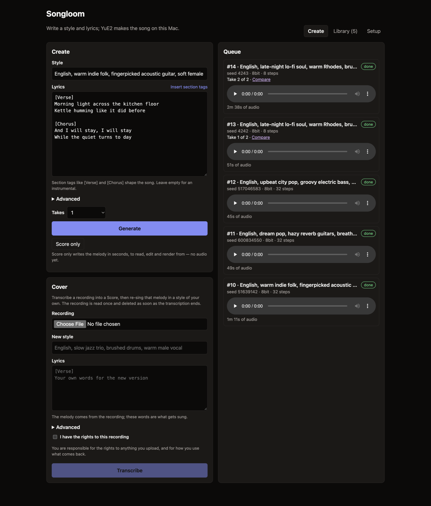
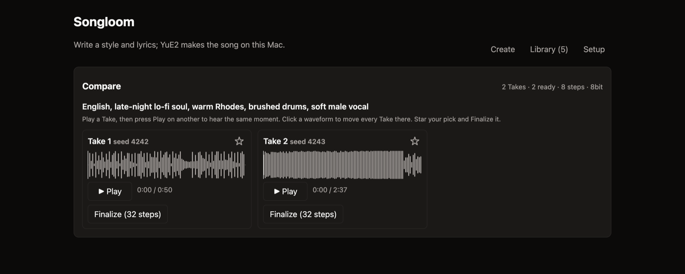
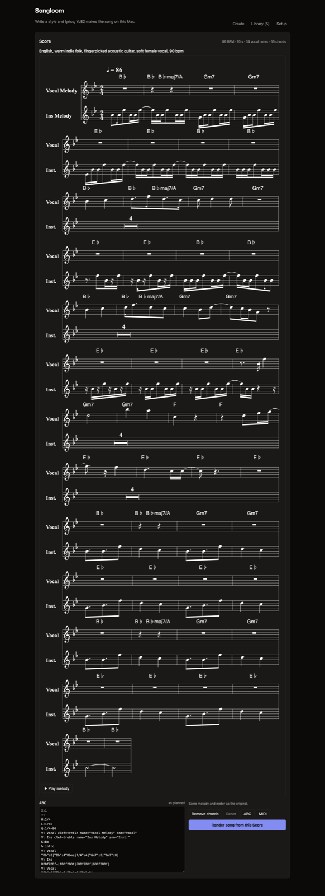
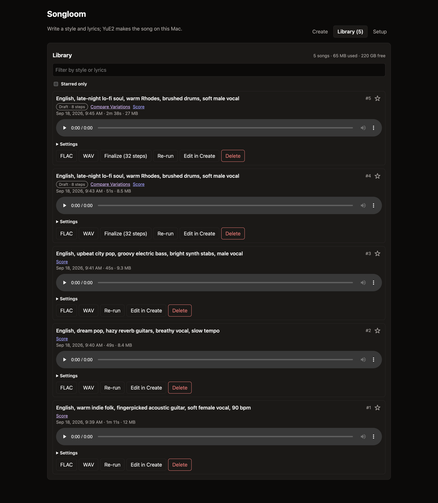
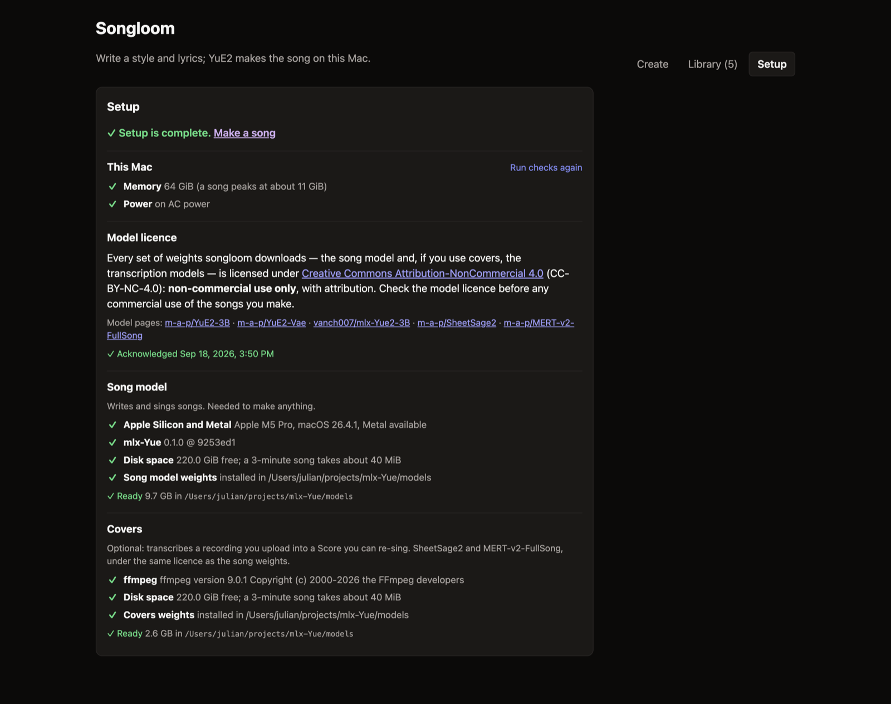

# Songloom

Write a style and some lyrics, get a whole song — vocals and accompaniment — generated on your
own Mac. Songloom is a local web app around the [YuE2](https://huggingface.co/m-a-p/YuE2-3B)
music model, running through the [mlx-Yue](https://github.com/vanch007/mlx-Yue) port on Apple
Silicon. Nothing is sent anywhere: the model, the weights and your songs stay on the machine.

> **Status: v0.1.0, early.** Apple Silicon only. NVIDIA support is planned but not started.

## Hear it first

Three songs made with songloom, nothing edited — style and lyrics in, these came out. Each is a
45-second excerpt of the full take (click to play):

| | Style given to the model |
|---|---|
| [indie-folk.mp3](docs/media/samples/indie-folk.mp3) | *English, warm indie folk, fingerpicked acoustic guitar, soft female vocal, 90 bpm* |
| [dream-pop.mp3](docs/media/samples/dream-pop.mp3) | *English, dream pop, hazy reverb guitars, breathy vocal, slow tempo* |
| [city-pop.mp3](docs/media/samples/city-pop.mp3) | *English, upbeat city pop, groovy electric bass, bright synth stabs, male vocal* |

Each took two to four minutes to render on an M5 Pro, at 32 synthesis steps.

## What it does

**Write a song** from a style description and lyrics, with section tags (`[Verse]`, `[Chorus]`),
a seed, precision and quality settings, and live per-stage progress you can cancel.



**Compare variations.** Queue 2–8 takes of one request with different seeds, then play them
against each other: one shared playhead, so pressing Play on another take continues from the
same moment. Star the one you want, and **Finalize** turns a quick 8-step draft into a full
32-step render that keeps the same music.



**Read and edit the Score.** The model plans a melody before it sings; you can see it as
notation, play it, edit the ABC with live validation and a diff against the original, and render
a song from your edit. Export ABC or MIDI.



**Keep what you make.** Everything lands in a library with playback, FLAC and WAV download, disk
usage, re-run, and permanent delete.



**Covers** (optional): upload a recording, have it transcribed into a Score, and re-sing that
melody with your own style and lyrics. The recording is deleted as soon as the job ends.

## Requirements

- macOS on Apple Silicon (M-series). The model peaks at about 11 GiB of unified memory, so
  24 GB or more is comfortable; below that, close other apps and local model servers.
- About 11 GB of disk for the song weights, downloaded from the Setup page on first run.
- For covers: [ffmpeg](https://ffmpeg.org) (`brew install ffmpeg`) and a further ~2.6 GiB of
  transcription weights.
- Songs must be rendered on AC power — mlx-Yue refuses to run on battery.

## Install

```sh
uv tool install git+https://github.com/TensorAtelier/songloom
songloom serve
```

Then open <http://127.0.0.1:8840>. The first run opens the Setup page, which checks the machine,
shows the model licence, and downloads the weights with progress — you can close the page and
come back; the download resumes.



No Node is needed to run it: the web app ships prebuilt.

| | |
|---|---|
| Your songs and settings | `~/Library/Application Support/songloom` (`--data DIR` or `$SONGLOOM_DATA` to move them) |
| The weights | `<data>/models`, or `--mlx-models DIR` if you keep them elsewhere |
| The app itself | a private environment under `~/.local/share/uv/tools/songloom`, with a `songloom` command on your PATH |

```sh
uv tool upgrade songloom      # pull a newer version
uv tool uninstall songloom    # remove the app (your songs and weights stay)
```

Nothing is installed system-wide, and removing the tool leaves your data alone — delete the data
directory yourself if you want the songs and the 11 GB of weights gone too.

## When something goes wrong

- **"Songs can't be made on battery."** mlx-Yue refuses to render unless the Mac is on AC power.
- **"macOS is short of memory."** A song needs about 11 GiB while it renders, and mlx-Yue stops
  rather than push the machine into swapping. Quit other local model servers — ComfyUI and
  LM Studio are the usual culprits — and start the job again.
- **The Setup page says the weights are incomplete.** Press Download again: it resumes, and it
  cleans up the metadata files that would otherwise make mlx-Yue reject the directory.
- **Covers are greyed out.** They need ffmpeg (`brew install ffmpeg`) and their own weights;
  the Covers part of the Setup page checks both and says which is missing.
- **A song fails with "Another Lyra process owns the GPU".** Another songloom (or another
  mlx-Yue job) is already running; only one can hold the GPU at a time.

## Licences

The code is Apache-2.0 (see [`LICENSE`](LICENSE)).

**The model weights are not.** YuE2 and the transcription models are
[CC BY-NC 4.0](https://creativecommons.org/licenses/by-nc/4.0/) — non-commercial use only — and
Songloom asks you to acknowledge that before it downloads anything. Check the model licence
before any commercial use of what you make, and if you upload a recording to cover, you are
responsible for having the rights to it. Third-party components are listed in
[`THIRD_PARTY_NOTICES.md`](THIRD_PARTY_NOTICES.md).

## Development

```sh
uv sync                     # Python side
cd web && npm install       # only if you are changing the page
uv run songloom serve --engine fake   # no GPU, no weights: scripted stages and a test tone

uv run pytest -q            # 240 tests, all on the fake engine
uv run ruff check .
cd web && npm run typecheck && npm run build   # the build is committed
```

Slow tests that need real weights and the GPU are opt-in:
`SONGLOOM_REAL_ENGINE=1 caffeinate -ims uv run pytest -q tests/test_real_engine.py`.

Architecture, conventions and the hard-won gotchas are in [`CLAUDE.md`](CLAUDE.md); the roadmap
and the reasoning behind the design are in [`PLAN.md`](PLAN.md).

## Credits

[YuE2](https://huggingface.co/m-a-p/YuE2-3B) and
[SheetSage2](https://huggingface.co/m-a-p/SheetSage2) by M-A-P; the Apple Silicon port
[mlx-Yue](https://github.com/vanch007/mlx-Yue) by vanch007. Songloom is an independent front end
and is not affiliated with either.
